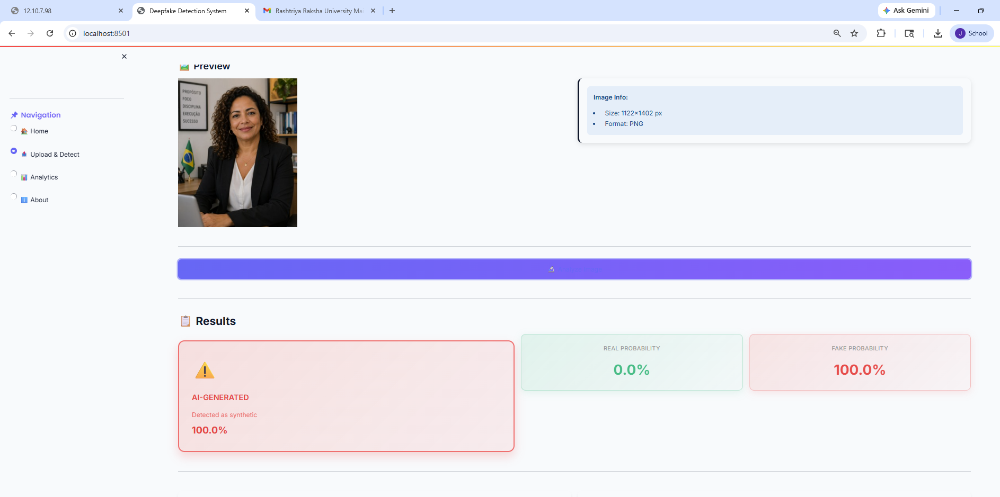
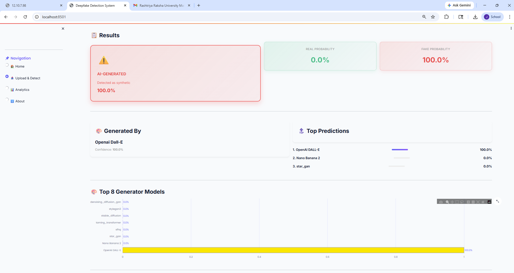
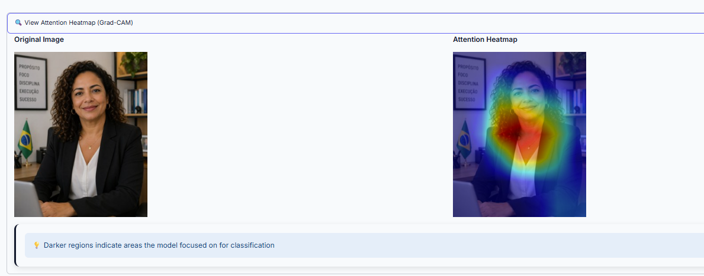

# 🕵️ Deepfake Detective

### AI-Powered Image Forgery Detection System


---

## 🚀 Overview

Deepfake Detective is an advanced AI system that detects whether an image is **Real or AI-generated** and identifies the **generator model** used.

---

## ✨ Key Features

✔ Real vs Fake Detection
✔ AI Generator Identification (25+ models)
✔ Grad-CAM Visualization
✔ Fast Processing (<1 sec)
✔ Clean Streamlit UI

---

## 🖼️ Demo Preview  

### 📌 Application Screenshot  






---

## 🏗️ Tech Stack

* Python
* PyTorch
* Streamlit
* OpenCV
* NumPy

---

## 📂 Project Structure

```
deepfake-detective/
│── app.py
│── inference.py
│── model.py
│── utils.py
│── requirements.txt
│── README.md
```

---

## ⚙️ Installation

```bash
git clone https://github.com/YOUR-USERNAME/YOUR-REPO.git
cd deepfake-detective
pip install -r requirements.txt
```

---

## ▶️ Run the Project

```bash
streamlit run app.py
```

Open in browser:
👉 http://localhost:8501

---

## 📊 Model Info

* Binary Classifier → ResNet50
* Generator Classifier → EfficientNet-B0
* Accuracy → ~96%

---

## ⚠️ Note

* Dataset and model files are not included due to size limits
* Download models from: *(Add your Google Drive link)*

---

## 🎯 Use Cases

* Fake image detection
* Social media verification
* Digital forensics

---

## 📌 Future Work

* Video deepfake detection
* API deployment
* Mobile app

---

## 👨‍💻 Author

Developed by **Your Name**

---

## ⭐ Support

If you like this project, give it a ⭐ on GitHub!
